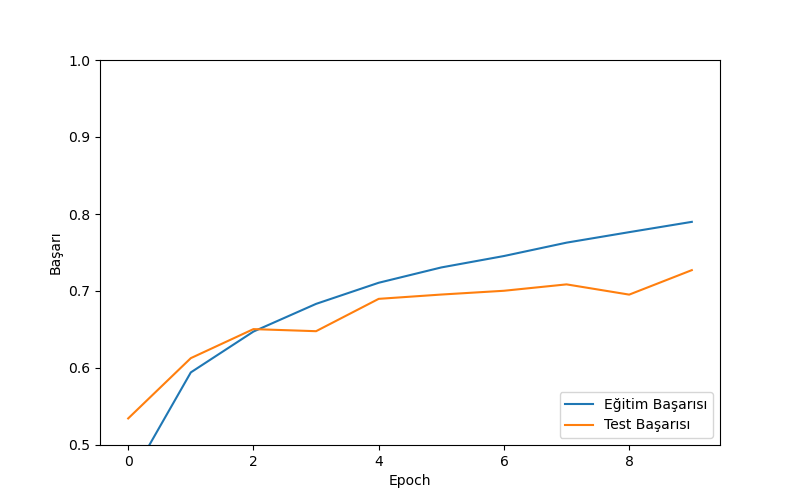

#CIFAR-10 Image Classification with CNN 
This project is a Deep Learning model developed using TensorFlow and Keras. It utilizes Convolutional Neural Networks (CNN) to classify images into 10 different object categories (Airplane, Car, Bird, Cat, Deer, Dog, Frog, Horse, Ship, Truck) using the CIFAR-10 dataset.
# Project Overview
In this project, I implemented:
- Data preprocessing and normalization on large datasets.
- Handling missing data and cleaning.
- Building a CNN architecture (Conv2D, Maxpooling, Dropout).
- Visualizing model performance (Accuracy/Loss graphs).

#Results
The model achieved approximately **70% accuracy** on the test dataset.


*(Training and Validation Accuracy over Epochs)*

#Tech Stack
- **Python** 3.x
- **TensorFlow / Keras**
- **NumPy** (Data Manipulation)
- **Matplotlib** (Data Visualization)

#Installation & Usage

1. Clone the repository:
   ```bash
   git clone [https://github.com/Mazlum3476/Cifar10-CNN-Project.git](https://github.com/Mazlum3476/Cifar10-CNN-Project.git)
